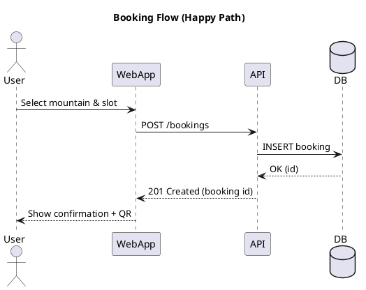

# Booking Flow (Sequence)

```plantuml
@startuml
title Booking Flow (Happy Path)

actor User
participant WebApp
participant API
database DB

User -> WebApp : Select mountain & slot
WebApp -> API  : POST /bookings
API   -> DB    : INSERT booking
DB --> API     : OK (id)
API --> WebApp : 201 Created (booking id)
WebApp --> User: Show confirmation + QR
@enduml
```
